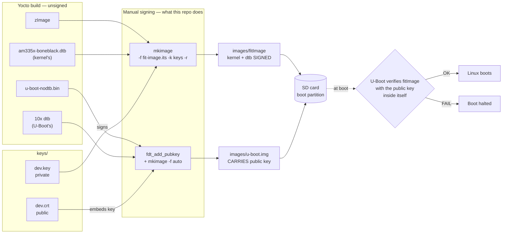
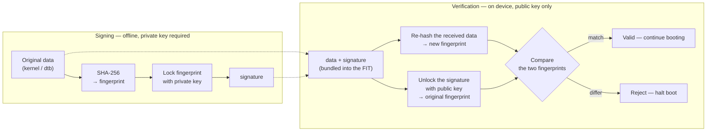

# arm-secure-boot

Trusted/Verified Boot on the BeagleBone Black: U-Boot verifies the RSA-2048/SHA-256
signature of the Linux kernel and device tree before booting, and refuses to boot if
either has been tampered with or signed with the wrong key.

Verified end-to-end on real hardware (AM335x GP, 2026-09-15).



---

## Requirements

| Component | Version used |
|---|---|
| Board | BeagleBone Black (AM335x, **GP** silicon) |
| Yocto | poky `scarthgap` (5.0.19), `MACHINE = beaglebone-yocto` |
| U-Boot | 2024.01 (from poky, `am335x_evm_defconfig`) |
| Kernel | linux-yocto 6.6.21 |
| Host tools | `openssl`, `mkimage`, `dtc`, `bitbake` |
| Other | SD card, UART-to-USB cable (to read boot logs) |

---

## Scope and limitations

The AM335x on the BBB is a **GP (General Purpose)** part — its Boot ROM **cannot verify
signatures at all** (confirmed in TRM `spruh73q`, section 26.1.1: *"the GP Device has its
security features disabled"*). Consequently:

- ROM → SPL: **no verification**
- SPL → U-Boot: **no verification**
- **U-Boot → kernel + dtb: VERIFIED** ← the scope of this project
- Kernel → rootfs: not verified (out of scope)

In other words, this protects the kernel and device tree from tampering **provided** the
running U-Boot is genuine. The loop cannot be closed on GP silicon because there is no
immutable hardware Root of Trust — this is a **deliberate residual risk**, not an
oversight. Full analysis: [`note-study/secure-boot-flow.md`](note-study/secure-boot-flow.md).

---

## How signing and verification work

RSA is asymmetric: what the **private key** locks, only the matching **public key** can
open — and the private key cannot be derived from the public one. SHA-256 turns data of
any size into a fixed 256-bit fingerprint that changes completely if a single bit of the
input changes.



This catches both attack classes:

- **Forgery** (no private key) — an attacker cannot produce a signature that the public
  key unlocks into the right fingerprint.
- **Tampering** (data modified, not re-signed) — the freshly computed fingerprint no
  longer matches the one recovered from the original signature.

**Why the public key must not travel inside the signed file:** an attacker could
otherwise generate their own key pair, modify the kernel, sign it with *their* private
key and ship *their* public key alongside — everything would be internally consistent and
verification would pass. The verifying key must come from somewhere the attacker cannot
replace at the same time, which is why it lives inside `u-boot.img` rather than inside
`fitImage`. The FIT only carries `key-name-hint = "dev"` — a label, not key material.

---

## Repository layout

```
├── docs/                 Original project specification (SRS), reference docs (AM335x TRM)
├── note-study/           Study notes: RSA/SHA-256, FIT, boot flow diagrams
├── keys/                 Signing key pair (dev.key is gitignored)
├── scripts/              fit-image.its — FIT image description
├── meta-secure-boot/     Yocto layer enabling CONFIG_FIT_SIGNATURE for U-Boot
└── images/               Final artifacts to flash (details: images/README.md)
```

---

## Reproducing from scratch

Let `$REPO` be this repository, `$POKY` the poky directory, and `$UB` the U-Boot build
directory (`$POKY/build/tmp/work/beaglebone_yocto-poky-linux-gnueabi/u-boot/2024.01/build`).

### 1. Generate an RSA-2048 key pair

```bash
cd $REPO
openssl genpkey -algorithm RSA -out keys/dev.key \
    -pkeyopt rsa_keygen_bits:2048 -pkeyopt rsa_keygen_pubexp:65537
openssl req -batch -new -x509 -key keys/dev.key -out keys/dev.crt
```

> `mkimage` requires the private key and certificate to share the same basename
> (`dev.key` / `dev.crt`).

### 2. Enable `CONFIG_FIT_SIGNATURE` in U-Boot

The `meta-secure-boot/` layer ships with this repo; just register it with Yocto:

```bash
cd $POKY && source oe-init-build-env build
bitbake-layers add-layer $REPO/meta-secure-boot
bitbake u-boot
```

Check the config was applied:

```bash
grep -E "CONFIG_FIT_SIGNATURE|CONFIG_RSA" $UB/.config
# CONFIG_FIT_SIGNATURE=y / CONFIG_RSA=y / CONFIG_RSA_VERIFY=y
```

### 3. Package and sign the FIT image (kernel + dtb)

```bash
cd $REPO/scripts
cp $POKY/build/tmp/deploy/images/beaglebone-yocto/zImage .
cp $POKY/build/tmp/deploy/images/beaglebone-yocto/am335x-boneblack.dtb .

mkimage -f fit-image.its -k ../keys -r ../images/fitImage

rm zImage am335x-boneblack.dtb   # clean up temporary inputs
```

### 4. Embed the public key into U-Boot

`u-boot.img` is a FIT containing 10 device trees (one per board); SPL selects the right
one for the BBB at runtime. The key must go into **U-Boot's own `am335x-boneblack.dtb`**,
after which the image is repackaged:

```bash
cd $UB
./tools/fdt_add_pubkey -a sha256,rsa2048 -k $REPO/keys -n dev -r conf \
    arch/arm/dts/am335x-boneblack.dtb

./tools/mkimage -f auto -A arm -T firmware -C none -O u-boot \
  -a 0x80800000 -e 0x80800000 -p 0x0 -n "U-Boot for am335x board" -E \
  -b arch/arm/dts/am335x-evm.dtb -b arch/arm/dts/am335x-bone.dtb \
  -b arch/arm/dts/am335x-sancloud-bbe.dtb -b arch/arm/dts/am335x-sancloud-bbe-lite.dtb \
  -b arch/arm/dts/am335x-sancloud-bbe-extended-wifi.dtb \
  -b arch/arm/dts/am335x-boneblack.dtb -b arch/arm/dts/am335x-evmsk.dtb \
  -b arch/arm/dts/am335x-bonegreen.dtb -b arch/arm/dts/am335x-icev2.dtb \
  -b arch/arm/dts/am335x-pocketbeagle.dtb \
  -d u-boot-nodtb.bin u-boot.img

cp u-boot.img MLO $REPO/images/
```

> **Do not run `make` after this step** — it rebuilds the dtb from source and wipes the
> embedded key.

Verify the key really is inside the image:

```bash
./tools/dumpimage -T flat_dt -p 6 -o /tmp/fdt6.dtb u-boot.img
dtc -I dtb -O dts /tmp/fdt6.dtb | grep -E 'required|key-name-hint'
# required = "conf"; / key-name-hint = "dev";
```

### 5. Flash to the SD card

```bash
# Recreate partitions + rootfs from the base image (ERASES EVERYTHING on /dev/sdX)
sudo dd if=$POKY/build/tmp/deploy/images/beaglebone-yocto/core-image-minimal-beaglebone-yocto.rootfs.wic \
        of=/dev/sdX bs=4M status=progress conv=fsync

# Overwrite the boot partition with the signed artifacts
sudo mount /dev/sdX1 /mnt/bbb-boot
sudo cp $REPO/images/{MLO,u-boot.img,fitImage} /mnt/bbb-boot/
sudo cp $REPO/images/extlinux.conf /mnt/bbb-boot/extlinux/extlinux.conf
sync && sudo umount /mnt/bbb-boot
```

> Identify the correct `/dev/sdX` with `lsblk` before running `dd`.

---

## Expected result

UART log on a successful boot:

```
## Loading kernel from FIT Image at 82000000 ...
   Using 'conf-1' configuration
   Verifying Hash Integrity ... sha256,rsa2048:dev+ OK
   Verifying Hash Integrity ... sha256+ OK
## Loading fdt from FIT Image at 82000000 ...
   Verifying Hash Integrity ... sha256,rsa2048:dev+ OK
Starting kernel ...
...
beaglebone-yocto login:
```

If the FIT is modified or signed with the wrong key, U-Boot stops with `Bad Data Hash` /
`Signature Verification Failed` and never hands control to the kernel.

---

## Troubleshooting

| Symptom | Cause |
|---|---|
| `ERROR: new format image overwritten` after verification passes | The kernel's `load`/`entry` in the `.its` overlaps the memory region the whole FIT is loaded into (`kernel_addr_r`). Use `0x80008000` for an ARM zImage. |
| Verification never runs, kernel boots straight away | `extlinux.conf` still points at `zImage` + `fdtdir`, or the key lacks `required = "conf"` |
| Key disappears after a rebuild | `make` was run after `fdt_add_pubkey`, rebuilding the dtb from source |
| Signed the wrong dtb, verification fails | Signed `u-boot.dtb` (the `am335x-evm` one) instead of `arch/arm/dts/am335x-boneblack.dtb` |

---

## References

- [`docs/SECURE-BOOT-ARM-DOCS.md`](docs/SECURE-BOOT-ARM-DOCS.md) — project specification (SRS)
- [`note-study/secure-boot-flow.md`](note-study/secure-boot-flow.md) — RSA/SHA-256 mechanics,
  boot flow diagrams (theoretical HS vs actual GP)
- [`images/README.md`](images/README.md) — per-artifact details
- [U-Boot Verified Boot](https://docs.u-boot.org/en/v2025.07/usage/fit/verified-boot.html)
  — official documentation (same content as `doc/usage/fit/` in the U-Boot source)
- TI AM335x TRM (`spruh73q`), section 26.1.1 — GP vs HS device
