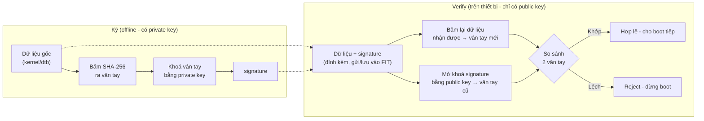
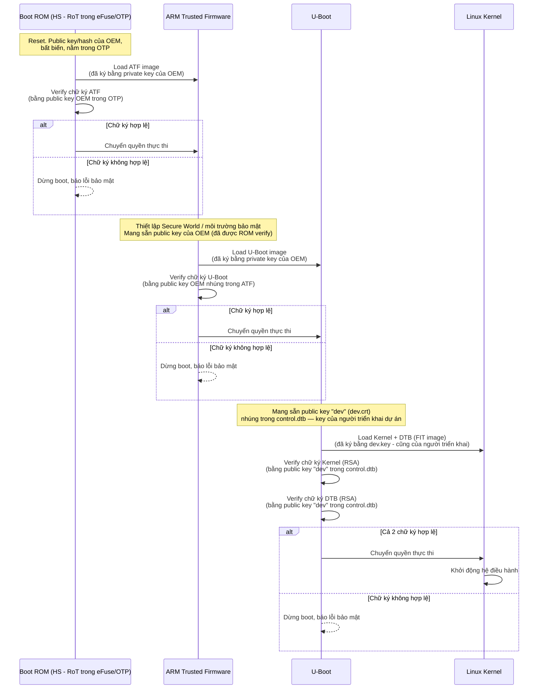
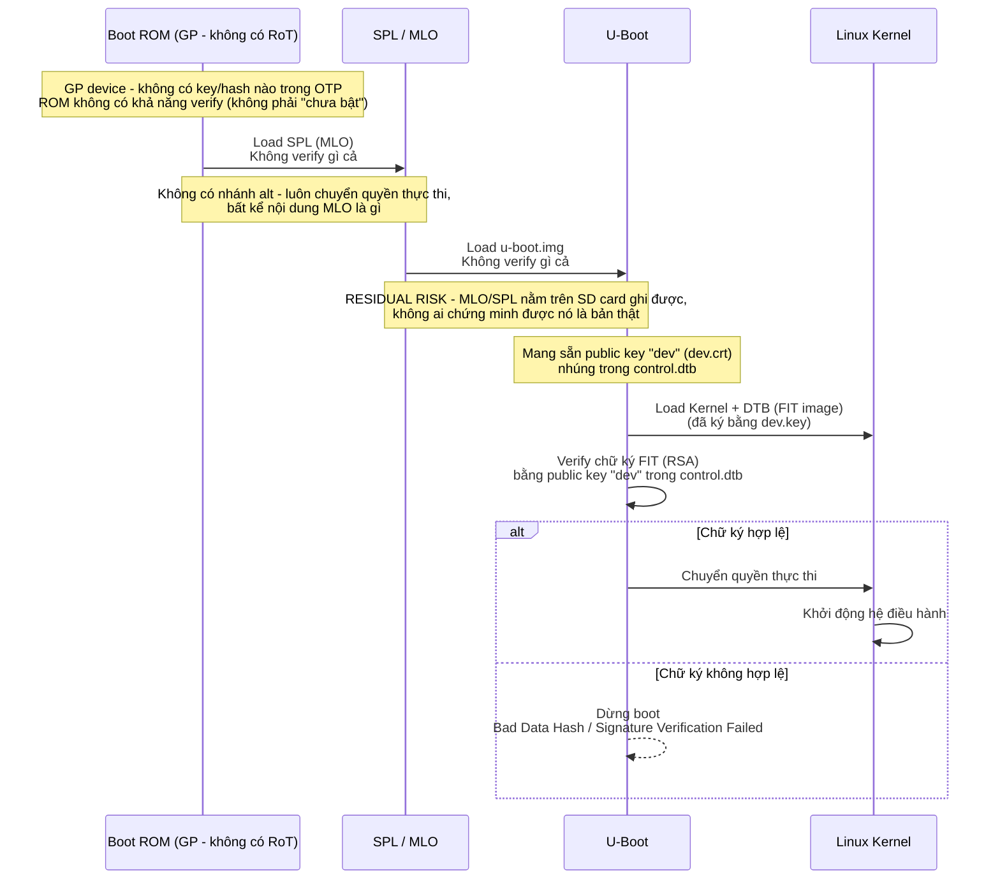

# Luồng Secure Boot

## 0. Bản chất "verify chữ ký" là làm gì (áp dụng chung cho mọi bước)

### 0.1. RSA là gì (chỉ cần hiểu ý nghĩa, không cần chứng minh toán học)

RSA sinh ra **1 cặp khoá liên quan với nhau về mặt toán học**: private key (giữ bí
mật) và public key (chia sẻ thoải mái). Đặc điểm quan trọng nhất:

- Cái gì được "khoá" bằng private key thì **chỉ public key tương ứng mới "mở"
  được** — không có chiều ngược lại.
- **Không thể suy ra private key từ public key** dù có công khai nó — đây là lý do
  RSA an toàn, không phải vì được giấu kỹ, mà vì bài toán toán học đứng sau nó
  cực khó giải ngược.
- Khác với mã hoá đối xứng (1 key dùng chung cả 2 chiều), RSA cho phép người
  **verify không bao giờ cần cầm secret** — chỉ cần public key là đủ kiểm tra.

**Mục đích thiết kế của RSA (trong use case ký số, không phải mã hoá bí mật):**

- Mục tiêu **không phải giữ kín dữ liệu** (kernel/dtb ai xem cũng được) — mục
  tiêu là chứng minh **tính xác thực** (đúng người có private key tạo ra) và
  **tính toàn vẹn** (không bị sửa).
- "Mở" (verify) chữ ký = **kiểm tra**, không phải "chiếm được bí mật". Vì vậy
  cố ý để **ai cũng verify được** (public key công khai, nhúng sẵn trong mọi
  U-Boot) — đây là mục đích, không phải sơ hở.
- Thứ RSA thực sự bảo vệ là chiều ngược lại: **không ai tạo được signature mới
  hợp lệ nếu không có private key** — verify (dùng public key) và tạo mới
  (cần private key) là 2 phép toán khác nhau, không suy ngược được từ cái này
  ra cái kia.
- Ví dụ dễ hình dung: con dấu mộc — ai cũng **đối chiếu được** con dấu có đúng
  mẫu không (verify, công khai), nhưng chỉ ai có **mộc thật** (private key)
  mới đóng ra được con dấu đó (tạo signature).

### 0.2. SHA-256 là gì (chỉ cần hiểu tính chất, không cần hiểu thuật toán bên trong)

SHA-256 là hàm băm (hash function) — biến **bất kỳ dữ liệu nào** (1 byte hay 1GB)
thành **1 chuỗi cố định 256 bit** ("vân tay" của dữ liệu đó). Tính chất cần nhớ:

- **1 chiều** — không thể từ hash suy ngược lại dữ liệu gốc.
- **Đổi 1 bit dữ liệu gốc → hash ra hoàn toàn khác**, không có kiểu "gần giống
  nhau thì hash gần giống nhau".
- **Cùng input luôn ra cùng output** — để verifier tự tính lại và so sánh được.

### 0.3. Kết hợp lại — đây là bản chất "verify chữ ký"

**Lúc ký** (offline, bên có private key):
1. Lấy dữ liệu gốc (ví dụ kernel), băm ra "vân tay" (SHA-256).
2. Dùng private key "khoá" cái vân tay đó lại → ra `signature`.
3. Đính kèm `signature` vào cùng dữ liệu gốc, gửi đi.

**Lúc verify** (trên thiết bị, chỉ có public key):
1. Tự băm lại dữ liệu **vừa nhận được** → ra 1 vân tay mới.
2. Dùng public key "mở khoá" `signature` đính kèm → ra vân tay cũ (lúc ký).
3. So 2 vân tay — khớp thì hợp lệ, lệch thì reject.

**Vì sao phát hiện được 2 loại tấn công:**
- **Giả mạo** (không có private key): không "khoá" được vân tay mới sao cho
  public key mở ra khớp — vì không suy được private key từ public key.
- **Chỉnh sửa dữ liệu** (có dữ liệu nhưng không ký lại): vân tay mới (băm lại
  từ dữ liệu đã sửa) sẽ khác hẳn vân tay cũ (mở ra từ chữ ký gốc, chưa đổi) —
  lệch ngay, dù dữ liệu chỉ đổi 1 bit.

### 0.4. Vì sao public key không được nằm chung file với dữ liệu bị ký

Điểm dễ hiểu nhầm: tưởng rằng có `hash` + có `private key` là đủ an toàn, kể cả
khi public key đi kèm ngay trong file bị verify. **Sai** — vì kẻ tấn công không
cần đoán/phá `private key` thật của bạn, họ chỉ cần **tự tạo một bộ (key +
data + signature) mới, hoàn toàn tự nhất quán với nhau**:

1. Tự tạo 1 cặp key MỚI của riêng họ (`openssl genpkey` — miễn phí, tức thì).
2. Sửa dữ liệu (kernel) theo ý họ.
3. Tự băm dữ liệu đã sửa → ra vân tay mới (hash là hàm công khai, ai tính
   cũng ra kết quả giống nhau, không có gì bí mật ở bước này).
4. Ký vân tay đó bằng **private key giả của chính họ** → hợp lệ 100% về mặt
   toán học, vì private/public key giả này khớp cặp với nhau.
5. Nhét **public key giả** vào cùng file, cạnh signature giả.

Nếu thiết bị đọc "public key nằm ngay trong file này, dùng nó verify luôn
signature cũng trong file này" → mọi thứ khớp nhau hoàn hảo, verify **pass**,
dù toàn bộ là do kẻ tấn công viết ra từ đầu đến cuối — không cần đụng tới
`dev.key` thật, không cần phá RSA.

**Cái duy nhất chặn được kiểu tấn công này:** thiết bị **không được tin public
key nằm trong file bị kiểm tra** — phải lấy public key từ **1 nơi cố định
khác, nằm ngoài file đó**, mà kẻ tấn công không sửa cùng lúc được. Đây chính
là lý do `control.dtb` (dính liền trong chính U-Boot binary — xem mục 2) tồn
tại tách biệt khỏi `fitImage`: `fitImage` chỉ chứa `key-name-hint` (chuỗi tên
gợi ý, không có giá trị bảo mật), **không** chứa `rsa,modulus`/`rsa,exponent`
thật — public key thật chỉ nằm duy nhất trong `control.dtb`.

## 1. Mô hình đầy đủ trên chip HS (theo lý thuyết / docs gốc)

Đây là chuỗi tin cậy đầy đủ như mô tả trong `docs/SECURE-BOOT-ARM-DOCS.md` mục 2.6,
giả định chạy trên chip **HS (High Security)** — có Root of Trust thật trong Boot ROM
(key/hash cố định trong eFuse/OTP, không thể sửa). BBB thực tế là chip **GP**, không có
mô hình này — xem phần 2 bên dưới cho luồng thực tế.

**5 bước đúng theo docs 2.6:** Boot ROM xác thực ATF → ATF xác thực U-Boot → U-Boot
xác thực Kernel → U-Boot xác thực DTB → Kernel khởi động OS. Mỗi bước fail đều dừng
boot ngay (FR-05).

### Ai ký, ai verify bằng key của ai

| Giai đoạn | Verify bằng public key của | Chữ ký là của |
|---|---|---|
| Boot ROM → ATF | Nhà sản xuất board/chip (OEM), key nằm trong eFuse | ATF image, ký bởi private key của OEM |
| ATF → U-Boot | Cũng của OEM (hoặc bên phát triển firmware), nhúng trong ATF | U-Boot image, ký bởi private key tương ứng |
| U-Boot → Kernel+DTB | Chính người triển khai — key `dev.crt` tự tạo, nhúng trong `control.dtb` | FIT (kernel+dtb), ký bằng `dev.key` — cũng chính người triển khai |

Ở 2 giai đoạn đầu (ROM→ATF, ATF→U-Boot), người ký và người verify là 2 bên khác nhau
(nhà sản xuất ký, chip verify). Ở giai đoạn cuối — cũng là giai đoạn thật sự triển khai
trong dự án này — người triển khai vừa là người ký (có `dev.key`) vừa là người kiểm
soát máy verify (U-Boot chứa `dev.crt`), vì đây là dự án tự làm, không phải chip đã có
sẵn OEM ký.

## 2. Luồng thực tế trên BBB (chip GP)

Khác với mô hình HS ở mục 1: chip AM335x trên board là bản **GP**, ROM **không
có khả năng verify gì cả** (đã xác nhận qua TRM, chương Initialization, mục
26.1.1 "Device Types" — GP device "has its security features disabled"). Scope
dự án chỉ làm verify từ U-Boot trở lên (xem `docs/SECURE-BOOT-ARM-DOCS.md`).

**Khác biệt so với mô hình HS ở mục 1:**
- Chỉ còn **1 điểm verify duy nhất** trong toàn chuỗi (U-Boot → Kernel+DTB) —
  thay vì 3 điểm (ROM→ATF, ATF→U-Boot, U-Boot→Kernel).
- 2 bước đầu (ROM→SPL, SPL→U-Boot) hoàn toàn **không có verify** — không phải
  vì chưa làm, mà vì không có Root of Trust nào để bắt đầu chuỗi (GP chip).
- **Residual risk đã biết và chấp nhận từ đầu dự án:** ai có quyền ghi SD card
  đều thay được MLO/u-boot.img mà không bị phát hiện — cơ chế FIT signing chỉ
  bảo vệ được kernel/dtb, với điều kiện U-Boot đang chạy là bản thật.
